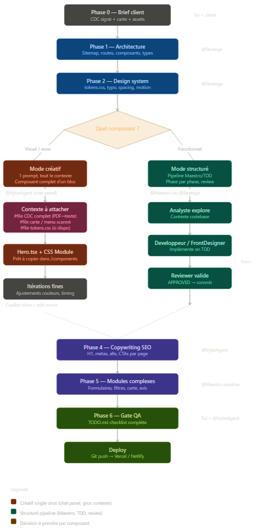

# Vybe Starter Kit

> Repo unique à cloner pour chaque nouveau projet client Vybe Digital.
> Contient : workflow, agents IA, prompts, TODO checklist, conventions.

## Démarrage rapide

```bash
# 1. Cloner pour un nouveau projet
git clone https://github.com/Yhugz/Ultra-Kit-Vybe.git nom-du-client
cd nom-du-client
rm -rf .git && git init

# 2. Installer les dépendances
npx create-next-app@latest . --typescript --app --tailwind=false
npm install gsap

# 3. Ouvrir VS Code
code .
```

> Les agents Copilot sont détectés **automatiquement** depuis `.vscode/prompts/` — aucune copie manuelle nécessaire.

## Structure du repo

```
vybe-starter/
│
├── README.md                    ← Tu es ici
├── KICKOFF.md                   ← Checklist de démarrage projet (à suivre dans l'ordre)
├── TODO.md                      ← Checklist dev complète (brief → deploy)
│
├── .vscode/
│   └── prompts/                 ← Agents Copilot (Vybe Crew)
│       ├── VybeAgent.agent.md       ← Agent principal (créatif + structuré)
│       ├── Maestro.agent.md         ← Orchestrateur pipeline
│       ├── Stratege.agent.md        ← Planificateur autonome
│       ├── Analyste-subagent.agent.md
│       ├── Developpeur-subagent.agent.md
│       ├── Explorateur-subagent.agent.md
│       ├── FrontDesigner-subagent.agent.md
│       └── Reviewer-subagent.agent.md
│
├── prompts/                     ← Prompts versionnés (1→5 + 2.5 créatif)
│   ├── 01-architecture.md
│   ├── 02-design-system.md
│   ├── 02-5-composant-creatif.md    ← NOUVEAU — single-shot créatif
│   ├── 03-execution-creative.md
│   ├── 04-copywriting.md
│   └── 05-modules-complexes.md
│
├── workflow/
│   ├── WORKFLOW.md              ← Process complet (6 phases + décision créatif/structuré)
│   └── CAHIER_DES_CHARGES_TEMPLATE.md
│
├── docs/
│   ├── CONVENTIONS.md           ← Standards de code, nommage, patterns
│   ├── DECISION-GUIDE.md       ← Quand utiliser quel agent/mode
│   └── workflow-diagram.png     ← Schéma visuel du workflow (créatif vs structuré)
│
├── plans/                       ← Plans générés par Stratege/Maestro (gitignored en prod)
│
├── styles/                      ← Design tokens (générés au Prompt 2)
│   └── .gitkeep
│
├── .github/
│   └── ISSUE_TEMPLATE/          ← Templates d'issues GitHub
│       ├── 01-cahier-des-charges.yml
│       ├── 02-prompt-architecture.md
│       ├── 03-prompt-design-system.md
│       ├── 04-prompt-execution-creative.md
│       ├── 05-prompt-copywriting.md
│       └── 06-prompt-modules-complexes.md
│
├── .gitignore
└── .env.example
```

## Qui fait quoi

| Tâche | Agent | Mode Copilot |
|---|---|---|
| Planifier l'architecture | `@Stratege` | Chat panel |
| Hero / section wow | `@VybeAgent` | Chat panel + #file (CDC, carte) |
| Itérer un composant | Copilot natif | Inline / Edit |
| Module complexe (form, filtre) | `@Maestro` → pipeline | Chat panel |
| Copywriting SEO | `@VybeAgent` | Chat panel |
| Debug / fix rapide | Copilot natif | Inline |
| QA pré-deploy | `@VybeAgent` + TODO.md | Chat panel |

## Workflow visuel



> **Lecture rapide :** branche gauche (rouge) = composants visuels → `@VybeAgent` single-shot.
> Branche droite (verte) = composants fonctionnels → `@Maestro` pipeline TDD.

<details>
<summary>Version texte</summary>

```
CDC signé
  ↓
Phase 1 — Architecture .............. @Stratege
  ↓
Phase 2 — Design system ............. @Stratege
  ↓
  ◇ Pour chaque composant :
  │
  ├─ Visuel / wow ? ─→ @VybeAgent (mode créatif, single-shot)
  │                     → Copilot inline pour itérer
  │
  └─ Fonctionnel ? ──→ @Maestro (pipeline TDD)
                        → Analyste → Dev → Review → Commit
  ↓
Phase 4 — Copywriting ............... @VybeAgent
  ↓
Phase 5 — Modules complexes ......... @Maestro pipeline
  ↓
Phase 6 — QA (TODO.md) .............. Toi + @VybeAgent
  ↓
Deploy → Vercel / Netlify
```

</details>

## Settings VS Code requis

```json
{
  "chat.customAgentInSubagent.enabled": true,
  "github.copilot.chat.responsesApiReasoningEffort": "high"
}
```

## Règle d'or

> **Vision créative = un gros prompt, tout le contexte, un seul tir.**
> **Logique métier = pipeline orchestré, TDD, review.**
>
> Ne jamais itérer 50 fois sur un composant visuel.
> Ne jamais faire un hero en pipeline TDD.
